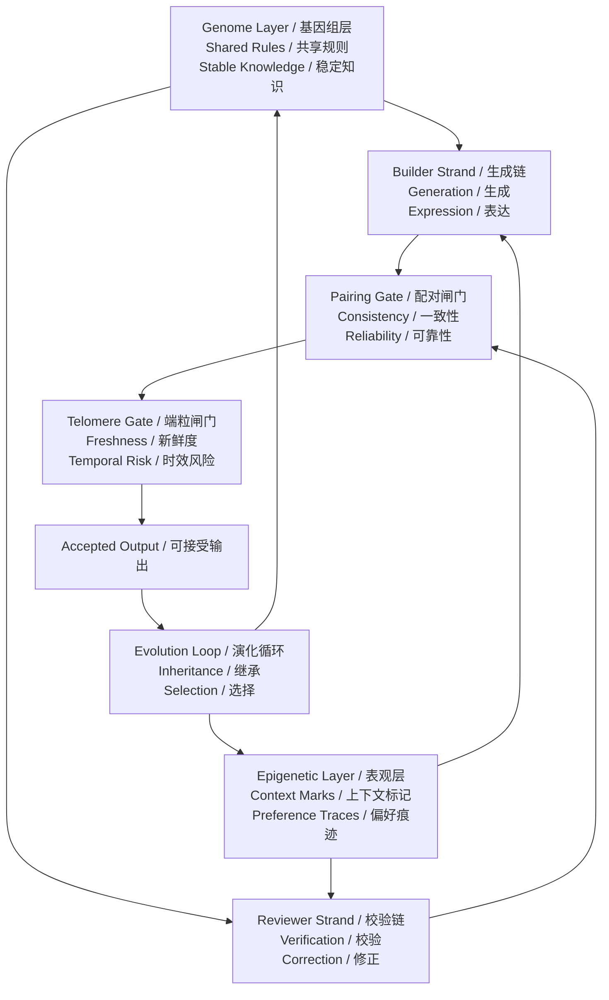
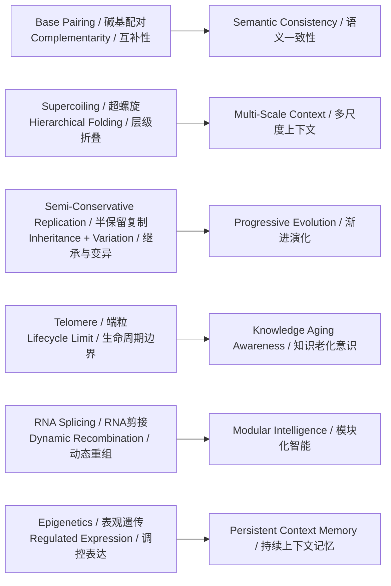
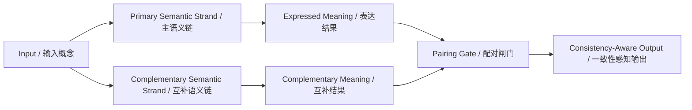
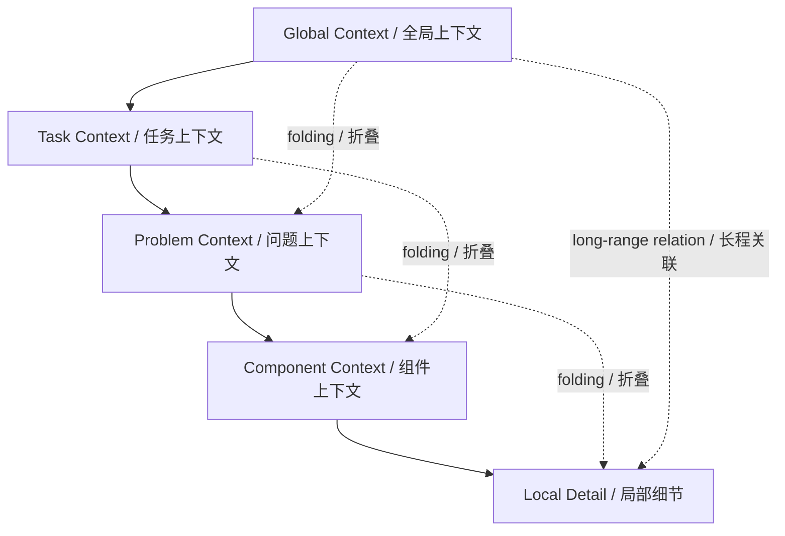
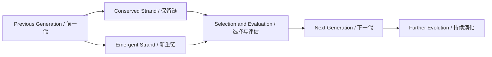
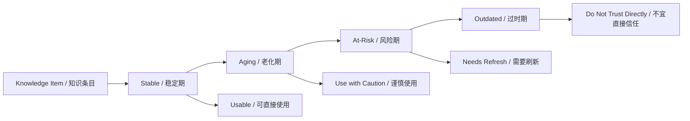
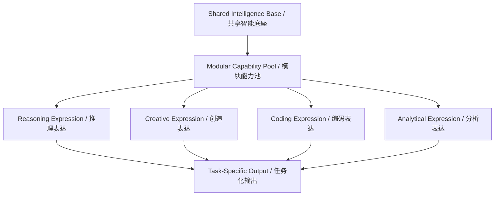
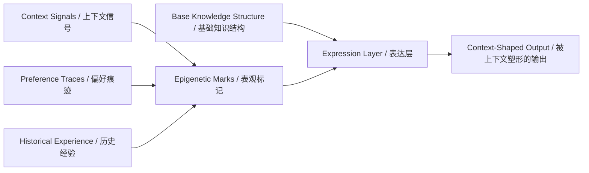

# DNA启发的双螺旋智能框架：面向高可靠人工智能与智能体系统的概念方案
# A DNA-Inspired Double-Helix Intelligence Framework for Reliable AI and Agentic Systems

**Author / 作者**: Shao Shengyi (shaoshengyi)  
**License / 许可**: MIT License

## 摘要 / Abstract

DNA不仅通过双螺旋结构与互补配对保存遗传信息，还通过超螺旋折叠、半保留复制、RNA剪接、表观遗传调控与端粒维护等机制，实现信息的稳定保存、动态组织、持续继承、功能重组、表达调节与生命周期管理。本方案将这些生物信息组织机制重新解释为人工智能中的一致性、上下文组织、渐进演化、知识时效、模块化能力与长期记忆等核心问题，提出“DNA启发的双螺旋智能框架”。

DNA preserves genetic information not only through the double helix and complementary base pairing, but also through supercoiled folding, semi-conservative replication, RNA splicing, epigenetic regulation, and telomere maintenance. Together, these mechanisms support stable storage, dynamic organization, inheritance, functional recombination, regulated expression, and lifecycle management. This proposal reinterprets those biological information principles as core questions in artificial intelligence, including consistency, context organization, progressive evolution, knowledge freshness, modular capability, and long-term memory, and introduces a DNA-inspired double-helix intelligence framework.

该框架并不将DNA理解为一种视觉隐喻，而是将其视为一种经过长期自然优化的信息系统。框架以共享规则层作为“基因组”，以经验性调节层作为“表观层”，并由“生成链”与“校验链”构成双螺旋主体结构，使智能系统在持续产出的同时具备持续自检、自稳与自适应特征。由此，人工智能不再被理解为单一路径上的输出过程，而被重新组织为一个由规则、记忆、表达、校验与演化反馈共同构成的复合信息系统。

The framework does not treat DNA as a visual metaphor. Instead, it treats DNA as a naturally optimized information system. It places a shared rule layer in the role of a “genome,” an experience-sensitive layer in the role of an “epigenetic layer,” and uses a generative strand plus a reviewing strand as the main double-helix structure. In this way, an intelligent system is framed not as a single-path output process, but as a composite information system jointly shaped by rules, memory, expression, verification, and evolutionary feedback.

本文将该框架界定为一种概念方案与理论表达。其目标不是给出具体工程路线，而是为高可靠人工智能、复杂智能体系统与长期记忆型智能环境提供一套更具结构性、可解释性与跨学科张力的统一叙述。

This document defines the framework as a conceptual proposal and theoretical language. Its purpose is not to provide an implementation roadmap, but to offer a more structured, interpretable, and interdisciplinary narrative for reliable AI, complex agentic systems, and long-horizon memory-aware intelligent environments.

## 关键词 / Keywords

DNA启发智能；双螺旋框架；高可靠人工智能；智能体系统；模块化智能；长期记忆；知识时效性  
DNA-inspired intelligence; double-helix framework; reliable AI; agentic systems; modular intelligence; long-term memory; knowledge freshness

## 1. 引言 / Introduction

当前人工智能的发展，正在从单体模型性能竞争转向对系统级可靠性、长期一致性、跨任务适应性与复杂协同能力的更高要求。仅依赖更大的参数规模、更长的上下文窗口或更强的单轮表现，并不足以完整回应这些挑战。相比之下，DNA所体现的信息组织逻辑，提供了一种更具系统性的观察视角：信息可以通过互补冗余获得稳定性，通过多尺度折叠获得可访问性，通过复制获得继承性，通过剪接获得功能重组能力，并通过表观调控与端粒维护建立环境敏感性和时间意识。

Artificial intelligence is increasingly moving beyond single-model performance competition toward higher demands for system-level reliability, long-term consistency, cross-task adaptability, and complex coordination. Larger parameter counts, longer context windows, or stronger single-turn performance alone are not enough to answer those demands. By contrast, the information logic embodied by DNA offers a more system-oriented perspective: information can gain stability through complementary redundancy, accessibility through multi-scale folding, inheritance through replication, functional recombination through splicing, and environmental plus temporal sensitivity through epigenetic regulation and telomere maintenance.

从这一角度出发，DNA的价值并不只是其化学结构，而在于它展示了一套高度成熟的信息处理原则。互补链提供稳定性，模板复制提供继承性，RNA剪接提供功能分化，表观遗传提供经验性调节，而端粒则体现出信息系统内部的生命周期意识。这些机制共同构成了一种兼具稳定性、灵活性、可重组性与可持续性的复杂系统。

From this viewpoint, the value of DNA lies not only in its chemistry, but in the mature information-processing principles it reveals. Complementary strands provide stability, template replication provides inheritance, RNA splicing provides functional differentiation, epigenetics provides experience-sensitive regulation, and telomeres introduce lifecycle awareness into the system. Together, these mechanisms form a complex system that combines stability, flexibility, recomposability, and continuity.

基于上述理解，本文提出DNA启发的双螺旋智能框架，并将其概括为六个相互关联的概念方向：互补式语义一致性、多尺度上下文组织、渐进式自我演化、知识生命周期意识、动态模块化智能以及可继承的上下文记忆。该框架关注的并非“如何模仿DNA的外观”，而是“如何借助DNA重新表达人工智能中最关键的系统问题”。

Building on that understanding, this document proposes a DNA-inspired double-helix intelligence framework and summarizes it through six interrelated conceptual directions: complementary semantic consistency, multi-scale context organization, progressive self-evolution, knowledge lifecycle awareness, dynamic modular intelligence, and inheritable context memory. The framework is not concerned with imitating the appearance of DNA, but with using DNA to re-express the most important system-level questions in AI.

## 2. 框架总览 / Framework Overview

本框架包含四个核心层次：共享规则层、经验性调节层、双链执行层与演化反馈层。共享规则层相当于“基因组”，承载系统的稳定原则；经验性调节层相当于“表观层”，承载上下文偏好与历史痕迹；双链执行层由生成链与校验链构成，分别承担表达与验证功能；演化反馈层则在继承与筛选中推动系统持续更新。

The framework contains four core layers: a shared rule layer, an experience-sensitive regulation layer, a double-strand execution layer, and an evolutionary feedback layer. The shared rule layer acts as the “genome” and holds stable system principles. The experience-sensitive layer acts as an “epigenetic layer” and carries contextual preferences and historical traces. The double-strand execution layer consists of a generative strand and a reviewing strand, while the evolutionary feedback layer drives continuous renewal through inheritance and selection.

### 图1 / Figure 1. 双螺旋智能框架总图 / Overall Structure of the Double-Helix Intelligence Framework



**图注 / Caption:** 该图展示了双螺旋智能框架的整体结构。系统以共享规则层为基础，以经验性调节层为塑形机制，通过生成链与校验链的协同运行形成稳定输出，并在一致性与时效性两道闸门之后进入继承与演化循环。  
This figure presents the overall structure of the double-helix intelligence framework. The system is grounded in a shared rule layer, shaped by an experience-sensitive regulation layer, stabilized through collaboration between a generative strand and a reviewing strand, and then passed through consistency and freshness gates before entering an inheritance-and-evolution loop.

### 图2 / Figure 2. DNA核心机制与AI概念映射图 / Mapping from DNA Mechanisms to AI Concepts



**图注 / Caption:** 该图展示了DNA核心信息机制与人工智能核心概念之间的抽象对应关系。这里的映射不是化学层面的复制，而是信息组织原则的迁移。  
This figure shows the abstract correspondence between core DNA information mechanisms and core AI concepts. The mapping is not a biochemical copy, but a transfer of information-organizing principles.

## 3. 六个核心方向 / Six Core Directions

### 3.1 方向一：碱基配对的语义互补编码 / Direction 1: Complementary Semantic Encoding Inspired by Base Pairing

DNA中的碱基配对体现了信息并非以孤立方式存在，而是在互补关系中获得稳定性与可恢复性。对应到人工智能中，这意味着智能系统不应依赖单一路径上的表达结果，而应同时具备彼此对应、相互约束的语义链路，使输出具备更高的一致性、可解释性与不确定性感知能力。

Base pairing in DNA shows that information does not exist in isolation, but gains stability and recoverability through complementarity. In AI terms, this suggests that intelligent systems should not depend on a single path of expression, but should maintain corresponding and mutually constraining semantic strands so that outputs become more consistent, interpretable, and uncertainty-aware.

这一方向强调：可靠智能的基础不是单次生成，而是互补校验。它所关注的是“结果是否成立”，而不仅是“结果是否生成出来”。

This direction argues that the foundation of reliable intelligence is not one-shot generation, but complementary verification. Its central question is not only whether an output can be produced, but whether it can hold together as a valid result.

#### 图3 / Figure 3. 碱基配对启发的互补式语义一致性框架 / Complementary Semantic Consistency Inspired by Base Pairing



**图注 / Caption:** 同一输入同时进入两条语义链路，最终在配对闸门处完成一致性判断。系统的可靠性由两条链的协同关系共同支撑。  
The same input enters two semantic strands at once and is finally evaluated at a pairing gate. System reliability is jointly supported by the coordination between the two strands.

### 3.2 方向二：DNA超螺旋的多尺度信息编码 / Direction 2: Multi-Scale Information Encoding Inspired by DNA Supercoiling

DNA不仅以线性序列存储信息，还通过多层折叠与超螺旋状态组织可访问性。不同折叠状态会改变远距离区域之间的关联方式，并影响表达与调控的层次结构。对应到人工智能中，这一机制启发我们重新理解长上下文与复杂任务：信息的重要性并不只取决于长度，更取决于多尺度组织方式。

DNA stores information not only as a linear sequence, but also organizes accessibility through multi-layer folding and supercoiled states. Different folding states change how distant regions relate to one another and shape the hierarchy of expression and regulation. In AI, this suggests a new understanding of long context and complex tasks: the importance of information depends not only on length, but on how it is organized across scales.

这一方向强调：高阶智能不仅依赖更多上下文，还依赖更好的上下文结构。

This direction argues that higher-order intelligence depends not only on more context, but on better context structure.

#### 图4 / Figure 4. 超螺旋启发的多尺度上下文组织框架 / Multi-Scale Context Organization Inspired by Supercoiling



**图注 / Caption:** 该图将“折叠”理解为不同上下文尺度之间的动态连接关系。系统对信息的访问不再是扁平展开，而是层次化组织与跨尺度关联的结合。  
This figure interprets “folding” as a dynamic relationship across context scales. Access to information is no longer flat expansion, but a combination of hierarchical organization and cross-scale linkage.

### 3.3 方向三：DNA复制的渐进式自举演化 / Direction 3: Progressive Bootstrapped Evolution Inspired by DNA Replication

DNA复制采用半保留逻辑，即在保留旧链的同时生成新链，使继承与变异同时发生。对应到人工智能中，这意味着智能系统的成长不应被理解为完全重写，而应被理解为一种在稳定基线之上的渐进更新。由此，系统能够在不丧失连续性的前提下实现演化。

DNA replication follows a semi-conservative logic: it preserves one old strand while synthesizing a new one, allowing inheritance and variation to happen together. In AI, this suggests that growth should not be seen as full replacement, but as progressive renewal built on top of a stable baseline. This enables evolution without sacrificing continuity.

这一方向强调：真正可持续的智能提升，来自继承、变化与筛选并存的结构，而不是单向替代。

This direction argues that durable improvement comes from a structure in which inheritance, change, and selection coexist, rather than from one-way replacement.

#### 图5 / Figure 5. 半保留复制启发的渐进式智能演化框架 / Progressive Intelligence Evolution Inspired by Semi-Conservative Replication



**图注 / Caption:** 系统的更新不是整体替换，而是在保留稳定结构的同时形成新表达，并通过评价与筛选进入下一代状态。  
System update is not total replacement. It preserves a stable structure while forming new expression, and then enters the next generation through evaluation and selection.

### 3.4 方向四：端粒机制的知识老化管理 / Direction 4: Knowledge Aging Management Inspired by Telomere Dynamics

端粒体现了生物系统中对复制寿命与时间风险的内在感知。对应到人工智能中，这意味着知识不应被默认为永久有效，不同知识具有不同的新鲜度、稳定度与时效风险。一个成熟的智能系统，不仅应判断内容是否成立，还应判断内容是否仍然适用。

Telomeres express an internal sensitivity to replicative lifespan and temporal risk in biological systems. In AI, this means knowledge should not be assumed to remain valid forever. Different knowledge items have different levels of freshness, stability, and temporal risk. A mature intelligent system should evaluate not only whether content is correct, but whether it is still applicable.

这一方向强调：未来智能系统不仅要知道“什么是对的”，还要知道“什么可能已经过时”。

This direction argues that future intelligent systems must know not only what is correct, but also what may already be outdated.

#### 图6 / Figure 6. 端粒启发的知识生命周期框架 / Knowledge Lifecycle Framework Inspired by Telomeres



**图注 / Caption:** 知识在系统中具有时间属性，并会随着环境变化逐步进入不同生命周期状态。时效判断成为智能可靠性的重要组成部分。  
Knowledge carries temporal attributes inside the system and gradually moves through distinct lifecycle states as the environment changes. Freshness judgment becomes a core part of intelligent reliability.

### 3.5 方向五：RNA剪接的动态模块组装 / Direction 5: Dynamic Modular Assembly Inspired by RNA Splicing

RNA剪接说明，同一段底层信息可以通过不同重组方式表达为不同功能结果。对应到人工智能中，这意味着智能不应被视为单块整体能力，而应被理解为一种可按任务动态组合、可随场景重组的模块化系统。不同功能表达可以共享基础结构，但不必以同一方式展开。

RNA splicing shows that the same underlying information can be recombined into different functional outcomes. In AI, this suggests that intelligence should not be treated as a single undivided capability, but as a modular system that can be dynamically assembled by task and recombined across situations. Different functional expressions may share a common base while unfolding in different ways.

这一方向强调：智能不是固定整体，而是可重组能力。

This direction argues that intelligence is not a fixed whole, but a recomposable set of capabilities.

#### 图7 / Figure 7. RNA剪接启发的动态模块化智能框架 / Dynamic Modular Intelligence Inspired by RNA Splicing



**图注 / Caption:** 共享基础信息通过不同能力模块的组合形成差异化表达，体现出单一底层结构与多种任务性能力之间的关系。  
Shared foundational information forms differentiated expression through combinations of capability modules, revealing the relation between a single base structure and multiple task-facing capabilities.

### 3.6 方向六：表观遗传的上下文记忆机制 / Direction 6: Context Memory Inspired by Epigenetic Regulation

表观遗传机制说明，DNA序列本身可以保持不变，而表达强度会受环境刺激、经验痕迹与历史状态影响。对应到人工智能中，这意味着系统不必每次都从零开始，而可以通过可保留、可积累、可衰减的上下文性标记，形成具有连续性的个体化表达。

Epigenetic regulation shows that the DNA sequence itself can remain unchanged while expression levels are influenced by environmental signals, experience traces, and historical states. In AI, this suggests that systems do not need to start from zero every time. Instead, they can form continuous and individualized expression through contextual markings that can be preserved, accumulated, and decayed over time.

这一方向强调：高质量智能不仅依赖稳定知识，还依赖长期保留的经验痕迹与偏好调节。

This direction argues that high-quality intelligence depends not only on stable knowledge, but also on long-lived experience traces and preference-sensitive regulation.

#### 图8 / Figure 8. 表观遗传启发的可继承上下文记忆框架 / Inheritable Context Memory Inspired by Epigenetic Regulation



**图注 / Caption:** 表观标记并不改变底层知识结构本身，但会持续影响系统的表达权重和输出倾向，形成可继承的上下文连续性。  
Epigenetic marks do not alter the underlying knowledge structure itself, but they continuously shape expression weights and output tendencies, forming inheritable contextual continuity.

## 4. 理论意义 / Theoretical Significance

DNA启发的双螺旋智能框架的价值，不在于把生物学结构直接套用到人工智能中，而在于提供一套更具系统性的信息组织语言。该框架将稳定性、可解释性、模块化、时效性、长期记忆与演化能力放入同一个叙述体系，使人工智能不再仅被视为参数规模扩张的结果，而被视为一个具备自组织、自校验、自调节与持续继承特征的复杂系统。

The value of the DNA-inspired double-helix intelligence framework does not lie in directly transplanting biological structure into AI, but in offering a more systematic language for information organization. It places stability, interpretability, modularity, freshness, long-term memory, and evolutionary capacity into a single narrative system, allowing AI to be viewed not merely as the result of parameter scaling, but as a complex system with self-organization, self-verification, self-regulation, and continuity through inheritance.

在这一意义上，DNA启发的双螺旋智能框架不仅是一种跨学科类比，也可以被视为面向未来高可靠人工智能与复杂智能体系统的一种概念基础。它更适合作为一个研究纲领、一种系统叙事和一套方法论起点，为后续的模型研究、智能体结构研究和长期记忆研究提供统一的理论坐标。

In that sense, the DNA-inspired double-helix intelligence framework is not only an interdisciplinary analogy, but also a possible conceptual foundation for future reliable AI and complex agentic systems. It is best understood as a research program, a systems narrative, and a methodological point of departure that can offer a unified theoretical coordinate system for later work on models, agent architectures, and long-term memory.

## 5. 方案定位 / Positioning

本文所提出的内容是一个概念框架，而不是具体产品说明、实现手册或工程指南。其核心作用是定义问题、统一语言、建立结构，并为后续研究和项目化表达提供高层次支撑。

The content proposed here is a conceptual framework rather than a product specification, implementation manual, or engineering guide. Its core function is to define problems, unify language, establish structure, and provide high-level support for later research and project-oriented expression.

## 6. 建议引用 / Suggested Citation

若本方案以概念框架、研究提案、学术海报或项目说明的形式被引用，可暂时采用以下仓库级引用格式：

If this framework is cited as a conceptual proposal, research note, academic poster, or project statement, the following repository-level citation format may be used as a temporary reference:

```bibtex
@misc{dna_double_helix_intelligence_framework_2026,
  author       = {Shao Shengyi},
  title        = {DNA-Inspired Double-Helix Intelligence Framework},
  year         = {2026},
  howpublished = {GitHub repository},
  note         = {Conceptual bilingual framework for reliable AI and agentic systems}
}
```

若后续补充了机构名、预印本链接、DOI 或版本号，建议将引用格式升级为对应的正式条目。

If you later add an institutional affiliation, preprint link, DOI, or versioned release information, the citation format can be upgraded to the corresponding final record.

## 7. 致谢 / Acknowledgements

本方案的概念表达受益于分子生物学中关于DNA双螺旋、复制机制、RNA剪接、表观遗传与端粒生物学的经典研究传统，同时也受益于人工智能与智能体系统研究中关于可靠性、模块性、记忆性与演化连续性的长期讨论。

The conceptual articulation of this proposal draws from classical research traditions in molecular biology concerning the DNA double helix, replication mechanisms, RNA splicing, epigenetics, and telomere biology, while also benefiting from long-running discussions in AI and agentic systems around reliability, modularity, memory, and evolutionary continuity.

## 8. 参考性背景文献 / Suggested Background References

1. Watson, J. D., & Crick, F. H. C. Molecular Structure of Nucleic Acids: A Structure for Deoxyribose Nucleic Acid.  
   Watson 与 Crick 关于核酸分子结构的经典论文。
2. Review literature on DNA replication and chromosome maintenance.  
   关于DNA复制与染色体维持的综述文献。
3. Review literature on RNA splicing and alternative splicing.  
   关于RNA剪接与可变剪接的综述文献。
4. Review literature on epigenetics and gene regulation.  
   关于表观遗传与基因调控的综述文献。
5. Review literature on telomere biology and chromosome-end protection.  
   关于端粒生物学与染色体末端保护的综述文献。
6. Review literature on chromatin folding, supercoiling, and multi-scale genome organization.  
   关于染色质折叠、超螺旋与多尺度基因组组织的综述文献。
