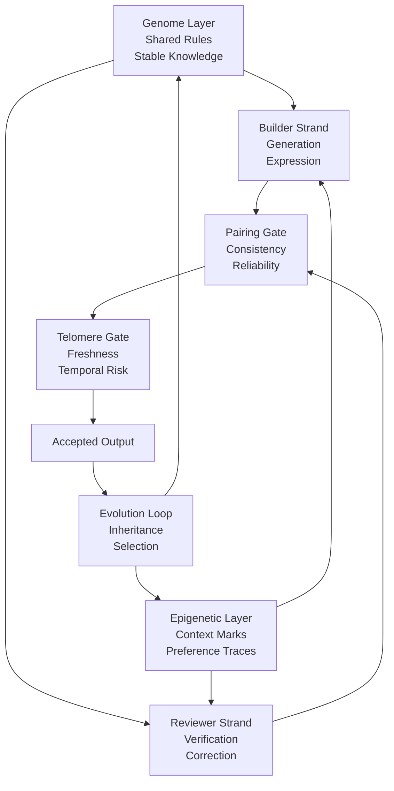
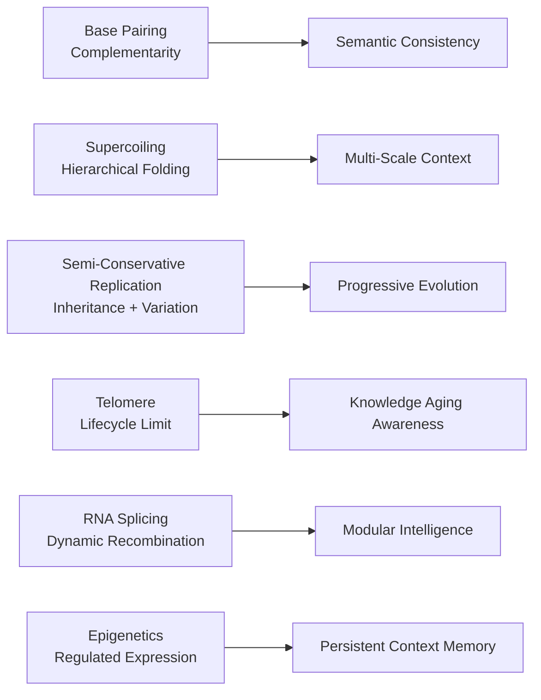
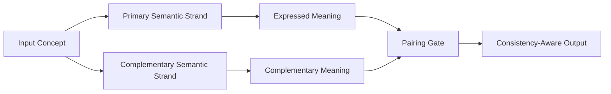
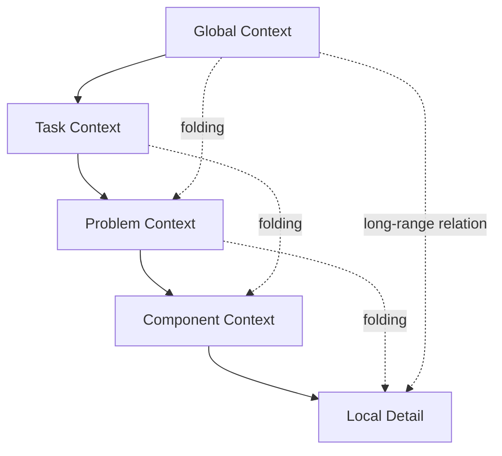
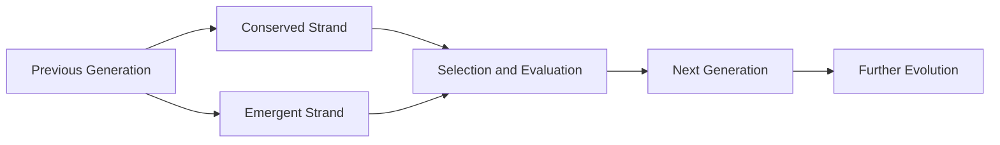
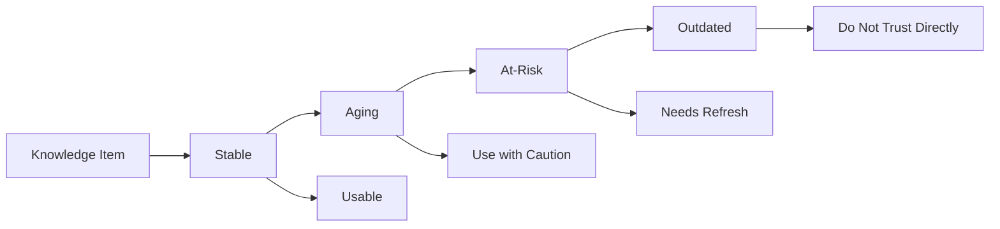
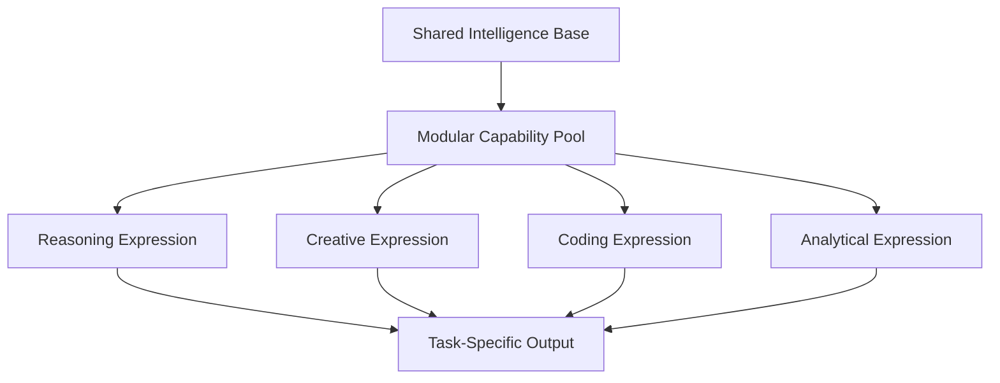
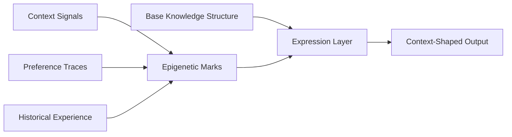

# DNA-Inspired Double-Helix Intelligence Framework

> A conceptual framework for reliable AI and agentic systems.

[English](README.md) | [简体中文](README.zh-CN.md)


**Contributor**: Shao Shengyi (shaoshengyi)  
**License**: MIT License

## Status

- Conceptual research framework
- Focused on theory, problem framing, and structural language
- Not a benchmark, implementation tutorial, or production toolkit

## Overview

DNA is not only a biological molecule, but also a highly structured information system. Through complementary pairing, hierarchical folding, strand-templated replication, RNA splicing, epigenetic regulation, and telomere maintenance, it supports stable storage, dynamic organization, inheritance, functional recombination, and lifecycle management.

This repository proposes a DNA-inspired double-helix intelligence framework that reinterprets those biological information mechanisms as principles of reliability, modularity, continuity, temporal awareness, and cumulative adaptation in future AI systems.

The core idea of the framework is simple:

- One strand is responsible for generation and expression
- One strand is responsible for verification and correction
- Both operate on top of shared rules, persistent memory, and evolutionary feedback

## Why This Project

Current AI is often discussed in terms of scale, performance, and task coverage. This framework argues that future AI systems should also be reconsidered in terms of:

- Consistency
- Self-correction
- Context organization
- Modular expression
- Temporal validity
- Memory continuity
- Controlled evolution

The DNA-inspired perspective offers a unified language for those system properties.

## Contents

- Framework Overview
- DNA-to-AI Mapping
- Six Conceptual Directions
- Repository Contents
- Research Positioning
- What This Repository Is and Is Not
- Suggested Citation
- License Status
- Acknowledgements
- Suggested Background Reading

## Framework Overview

The framework contains four conceptual layers:

1. A stable rule layer
2. A context-marking layer
3. A double-strand execution layer
4. An evolutionary feedback layer



**Figure 1.** Overall structure of the DNA-inspired double-helix intelligence framework.

## DNA-to-AI Mapping

The diagram below shows how core DNA mechanisms are reinterpreted as AI system principles.



**Figure 2.** Abstract mapping between DNA mechanisms and AI system concepts.

## Six Conceptual Directions

### 1. Complementary Semantic Consistency

Reliable intelligence should not depend on a single generative path. It should contain complementary expressive perspectives that support consistency, verification, and uncertainty awareness.



**Figure 3.** Complementary semantic consistency inspired by base pairing.

### 2. Multi-Scale Context Organization

Intelligence is not only about having more context, but also about building better organizational relations between global structure and local detail.



**Figure 4.** Multi-scale context organization inspired by DNA supercoiling.

### 3. Progressive Intelligence Evolution

New intelligent states should preserve stable references while allowing controlled change, forming cumulative improvement rather than total replacement.



**Figure 5.** Progressive intelligence evolution inspired by semi-conservative replication.

### 4. Knowledge Lifecycle Awareness

Not all knowledge should be treated as permanently valid. A mature system must distinguish durable knowledge from time-sensitive knowledge.



**Figure 6.** Knowledge lifecycle awareness inspired by telomere dynamics.

### 5. Dynamic Modular Intelligence

The same underlying intelligence system should be able to express different capabilities through dynamic recombination rather than being treated as a fixed whole.



**Figure 7.** Dynamic modular intelligence inspired by RNA splicing.

### 6. Persistent Context Memory

Intelligent systems should preserve experience traces and contextual preferences without rewriting the entire foundational structure every time.



**Figure 8.** Persistent context memory inspired by epigenetic regulation.

## Repository Contents

The repository currently contains the following public-facing files:

- [README.md](README.md): English GitHub homepage version
- [README.zh-CN.md](README.zh-CN.md): Chinese GitHub homepage version
- [DNA-Double-Helix-Academic.md](DNA-Double-Helix-Academic.md): bilingual long-form academic note
- [CITATION.md](CITATION.md): bilingual citation guidance
- [LICENSE](LICENSE): MIT license file

The repository is ready for use as a GitHub homepage, research-facing project page, or conceptual framework release.

## Research Positioning

This repository presents a conceptual framework rather than an implementation roadmap. Its goal is to provide a unified structural language for reliability, modularity, long-term memory, temporal validity, and evolutionary continuity.

It is intended to support:

- Research framing
- Conceptual paper drafting
- Project positioning
- Long-form architecture narratives
- AI and agent-system theory discussions

## What This Repository Is and Is Not

### This repository is

- A conceptual research note
- A structural language for future AI systems
- A unifying framework across reliability, memory, modularity, and evolution

### This repository is not

- A benchmark leaderboard
- An implementation tutorial
- A production library
- A model release repository

## Suggested Citation

If you want to reference this framework in a paper, report, talk, or project document, you can temporarily use the following repository-level citation format:

```bibtex
@misc{dna_double_helix_intelligence_framework_2026,
  author       = {Shao Shengyi},
  title        = {DNA-Inspired Double-Helix Intelligence Framework},
  year         = {2026},
  howpublished = {GitHub repository},
  note         = {Conceptual bilingual framework for reliable AI and agentic systems}
}
```

If you later add an institutional affiliation, preprint link, DOI, or release version, this citation can be updated to its final form.

For fuller citation guidance, see [CITATION.md](CITATION.md).

## License Status

The repository includes a formal [MIT License](LICENSE). This allows others to use, copy, modify, publish, and distribute the project content, as long as the original copyright and license notice are preserved.

## Acknowledgements

The articulation of this framework is informed by classical molecular biology traditions around the DNA double helix, replication, RNA splicing, epigenetics, and telomere dynamics, as well as by contemporary discussions in AI and agentic systems around reliability, memory, modularity, and long-horizon coordination.

The README structure is also informed by mature high-star open-source projects, especially in how they define project scope clearly, make boundaries explicit, keep modules browsable, and prioritize visual structure early.

## Suggested Background Reading

1. Watson and Crick on the molecular structure of nucleic acids
2. Review literature on DNA replication and chromosome maintenance
3. Review literature on RNA splicing and alternative splicing
4. Review literature on epigenetics and gene regulation
5. Review literature on telomere biology and chromosome-end protection
6. Review literature on chromatin folding, supercoiling, and multi-scale genome organization
