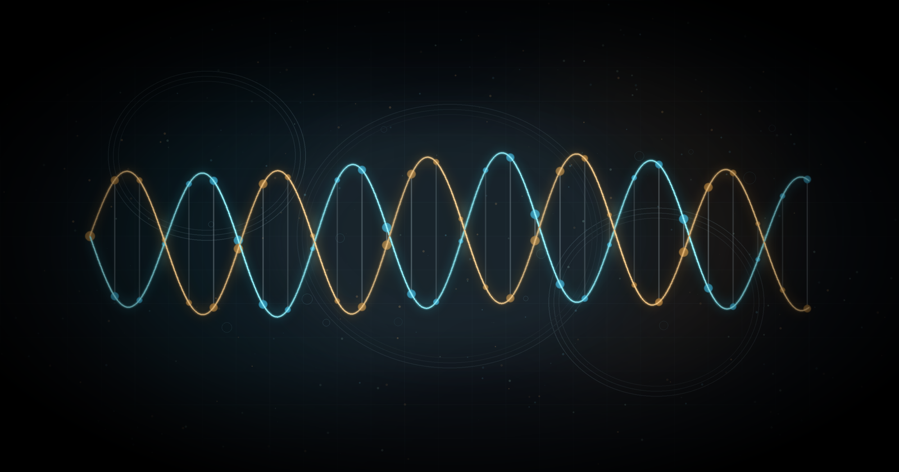
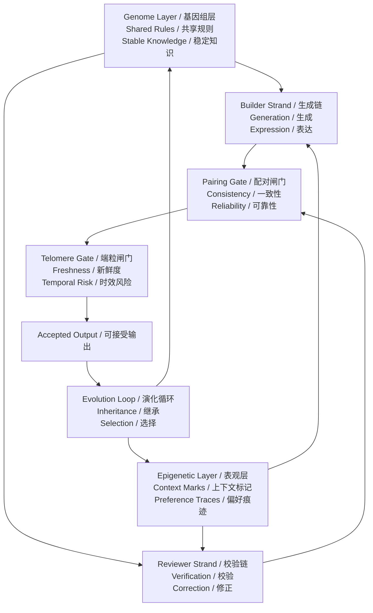
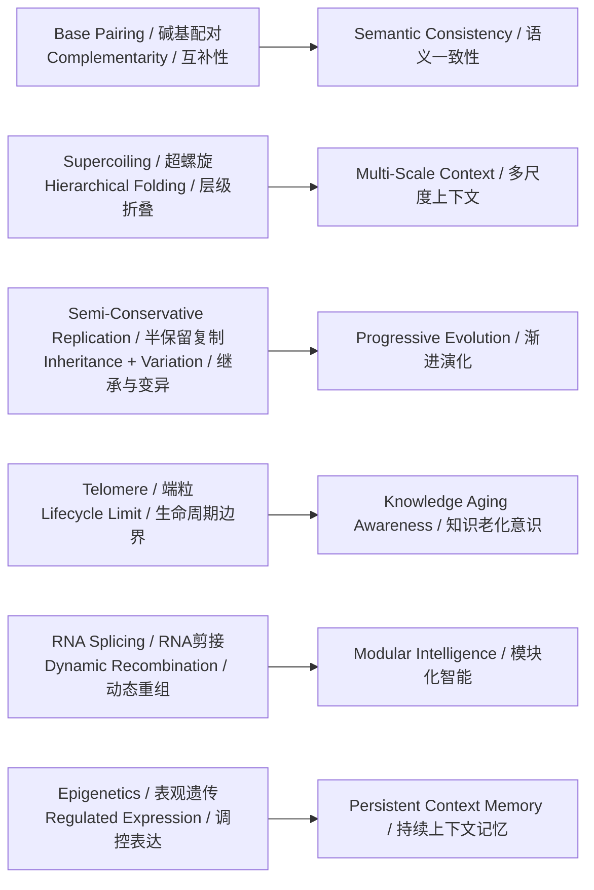
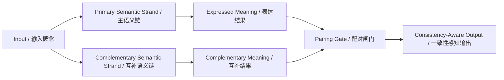
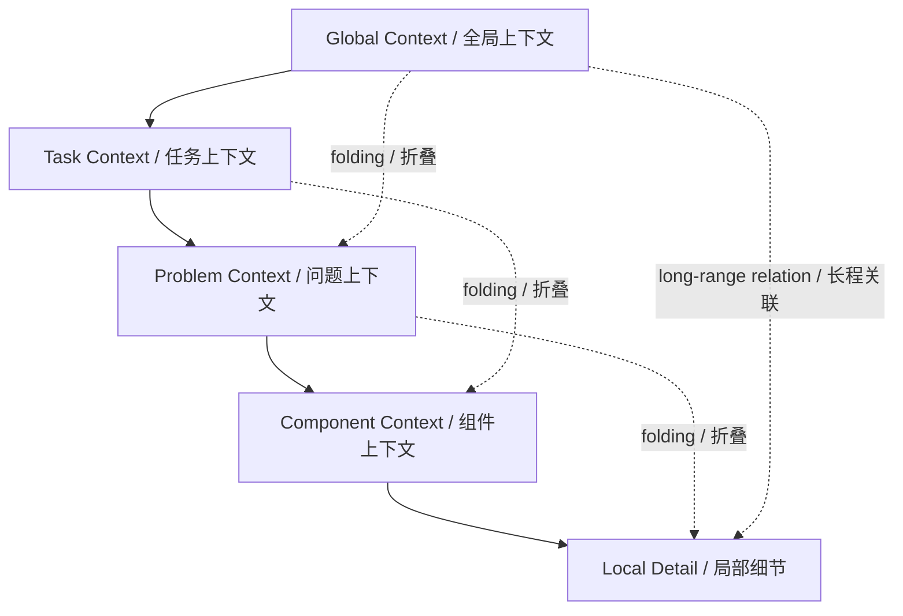
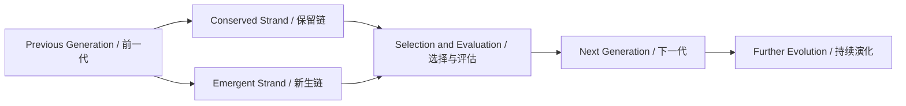
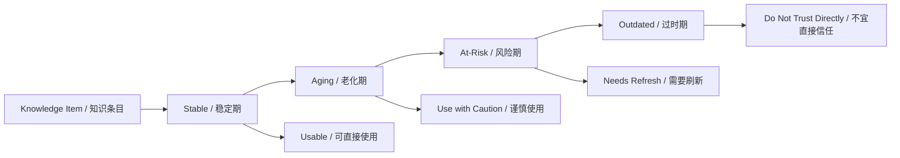
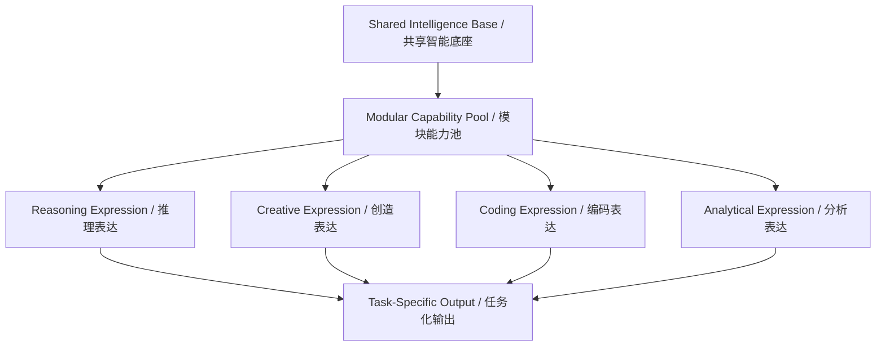
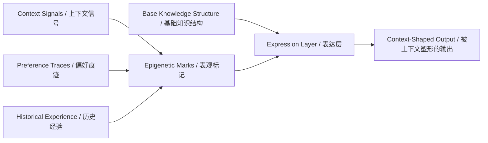

# DNA启发的双螺旋智能框架  
# DNA-Inspired Double-Helix Intelligence Framework

> 面向高可靠人工智能与智能体系统的概念框架。  
> A conceptual framework for reliable AI and agentic systems.



**Project Contributors / 项目贡献者**: Shao Shengyi (shaoshengyi)  
**License / 许可协议**: MIT License

## 项目状态 / Status

- 概念研究框架 / Conceptual research framework
- 关注理论表达、问题定义与结构语言 / Focused on theory, framing, and structural language
- 不是 benchmark、实现教程或生产工具包 / Not a benchmark, implementation tutorial, or production toolkit

## 项目概述 / Overview

DNA不仅是一种生物分子，也是一种高度结构化的信息系统。它通过互补配对、层级折叠、模板复制、RNA剪接、表观遗传调控与端粒维护，实现稳定保存、动态组织、继承更新、功能重组与生命周期管理。

DNA is not only a biological molecule, but also a highly structured information system. Through complementary pairing, hierarchical folding, strand-templated replication, RNA splicing, epigenetic regulation, and telomere maintenance, it supports stable storage, dynamic organization, inheritance, functional recombination, and lifecycle management.

本仓库提出一个“DNA启发的双螺旋智能框架”，将这些生物信息机制重新解释为未来人工智能系统中的可靠性、模块性、连续性、时效意识与累积适应能力。

This repository proposes a DNA-inspired double-helix intelligence framework that reinterprets those biological information mechanisms as principles of reliability, modularity, continuity, temporal awareness, and cumulative adaptation in future AI systems.

这个框架的核心思想很简单：

The core idea of the framework is simple:

- 一条链负责生成与表达 / one strand is responsible for generation and expression
- 一条链负责验证与修正 / one strand is responsible for verification and correction
- 两条链运行在共享规则、持续记忆与演化反馈之上 / both operate on top of shared rules, persistent memory, and evolutionary feedback

## 为什么是这个项目 / Why This Project

当前AI常常以规模、性能和任务覆盖率来讨论。这个框架认为，未来AI系统还应当从以下维度被重新讨论：

Current AI is often discussed in terms of scale, performance, and task coverage. This framework argues that future AI systems should also be reconsidered in terms of:

- 一致性 / consistency
- 自我修正 / self-correction
- 上下文组织 / context organization
- 模块化表达 / modular expression
- 时间有效性 / temporal validity
- 记忆连续性 / memory continuity
- 可控演化 / controlled evolution

DNA启发视角为这些系统属性提供了一种统一语言。

The DNA-inspired perspective offers a unified language for those system properties.

## 内容导航 / Contents

- 框架总览 / Framework Overview
- DNA到AI映射 / DNA-to-AI Mapping
- 六个概念方向 / Six Conceptual Directions
- 仓库内容 / Repository Contents
- 研究定位 / Research Positioning
- 这个仓库是什么、不是什么 / What This Repository Is and Is Not
- 建议引用 / Suggested Citation
- 许可状态 / License Status
- 致谢 / Acknowledgements
- 建议阅读 / Suggested Background Reading

## 框架总览 / Framework Overview

这个框架包含四个概念层：

The framework contains four conceptual layers:

1. 稳定规则层 / a stable rule layer
2. 上下文标记层 / a context-marking layer
3. 双链执行层 / a double-strand execution layer
4. 演化反馈层 / an evolutionary feedback layer



**图1 / Figure 1.** DNA启发的双螺旋智能框架总图。  
Overall structure of the DNA-inspired double-helix intelligence framework.

## DNA到AI映射 / DNA-to-AI Mapping

下图展示了DNA核心机制如何被重新解释为AI系统原则。

The diagram below shows how core DNA mechanisms are reinterpreted as AI system principles.



**图2 / Figure 2.** DNA核心机制与AI系统概念的抽象映射。  
Abstract mapping between DNA mechanisms and AI system concepts.

## 六个概念方向 / Six Conceptual Directions

### 1. 互补式语义一致性 / Complementary Semantic Consistency

可靠智能不应依赖单一路径上的生成结果，而应包含彼此互补的表达视角，以支持一致性、校验与不确定性感知。

Reliable intelligence should not depend on a single generative path. It should contain complementary expressive perspectives that support consistency, verification, and uncertainty awareness.



**图3 / Figure 3.** 碱基配对启发的互补式语义一致性。  
Complementary semantic consistency inspired by base pairing.

### 2. 多尺度上下文组织 / Multi-Scale Context Organization

智能不仅意味着拥有更多上下文，也意味着能够在全局结构与局部细节之间建立更好的组织关系。

Intelligence is not only about having more context, but also about building better organizational relations between global structure and local detail.



**图4 / Figure 4.** 超螺旋启发的多尺度上下文组织。  
Multi-scale context organization inspired by DNA supercoiling.

### 3. 渐进式智能演化 / Progressive Intelligence Evolution

新的智能状态应在保留稳定参照的同时允许受控变化，从而形成累积式进步，而不是完全替代。

New intelligent states should preserve stable references while allowing controlled change, forming cumulative improvement rather than total replacement.



**图5 / Figure 5.** 半保留复制启发的渐进式智能演化。  
Progressive intelligence evolution inspired by semi-conservative replication.

### 4. 知识生命周期意识 / Knowledge Lifecycle Awareness

不是所有知识都应被视为永久有效。成熟系统需要区分稳定知识与时间敏感知识。

Not all knowledge should be treated as permanently valid. A mature system must distinguish durable knowledge from time-sensitive knowledge.



**图6 / Figure 6.** 端粒启发的知识生命周期意识。  
Knowledge lifecycle awareness inspired by telomere dynamics.

### 5. 动态模块化智能 / Dynamic Modular Intelligence

同一底层智能系统应能够通过动态重组表达不同能力，而不是被看作固定不变的整体。

The same underlying intelligence system should be able to express different capabilities through dynamic recombination rather than being treated as a fixed whole.



**图7 / Figure 7.** RNA剪接启发的动态模块化智能。  
Dynamic modular intelligence inspired by RNA splicing.

### 6. 持续上下文记忆 / Persistent Context Memory

智能系统应保留经验痕迹和上下文偏好，而不需要每次都重写整个基础结构。

Intelligent systems should preserve experience traces and contextual preferences without rewriting the entire foundational structure every time.



**图8 / Figure 8.** 表观遗传启发的持续上下文记忆。  
Persistent context memory inspired by epigenetic regulation.

## 仓库内容 / Repository Contents

当前仓库包含两份核心主体文档，并附带引用与许可证文件，分别服务于不同发布场景：

This repository currently contains two core documents, along with citation and license files, designed for different release scenarios:

- [README.md](/D:/README.md)：GitHub首页版本 / the GitHub homepage version
- [DNA-Double-Helix-Academic.md](/D:/DNA-Double-Helix-Academic.md)：学术平台发布版本 / the academic-platform version

当前仓库已经补充封面视觉、双语引用说明与明确许可证，适合直接用于 GitHub 首页展示、研究介绍页或概念型项目发布。

The repository now includes a cover visual, bilingual citation guidance, and an explicit license, making it ready for use as a GitHub homepage, research-facing project page, or conceptual framework release.

## 研究定位 / Research Positioning

这个仓库提供的是一个概念框架，而不是实现路线。它的目标是为可靠性、模块性、长期记忆、时效性与演化连续性提供一种统一的结构语言。

This repository presents a conceptual framework rather than an implementation roadmap. Its goal is to provide a unified structural language for reliability, modularity, long-term memory, temporal validity, and evolutionary continuity.

它适合用于：

It is intended to support:

- 研究议题组织 / research framing
- 概念论文撰写 / conceptual paper drafting
- 项目定位表达 / project positioning
- 长篇架构叙事 / long-form architecture narratives
- AI与智能体系统理论讨论 / AI and agent-system theory discussions

## 这个仓库是什么、不是什么 / What This Repository Is and Is Not

### 这是 / This repository is

- 一个概念性研究说明 / a conceptual research note
- 一种面向未来AI系统的结构语言 / a structural language for future AI systems
- 一个统一可靠性、记忆、模块化与演化的理论框架 / a unifying framework across reliability, memory, modularity, and evolution

### 这不是 / This repository is not

- benchmark 排行榜 / a benchmark leaderboard
- 实现教程 / an implementation tutorial
- 生产级库 / a production library
- 模型发布仓库 / a model release repository

## 建议引用 / Suggested Citation

如果你希望在论文、报告、讲座或项目文档中引用本框架，可以暂时使用下面这条仓库级引用格式：

If you want to reference this framework in a paper, report, talk, or project document, you can temporarily use the following repository-level citation format:

```bibtex
@misc{dna_double_helix_intelligence_framework_2026,
  author       = {Shao Shengyi},
  title        = {DNA-Inspired Double-Helix Intelligence Framework},
  year         = {2026},
  howpublished = {GitHub repository},
  note         = {Conceptual bilingual framework for reliable AI and agentic systems}
}
```

如果后续你补充了机构名、预印本链接、DOI 或版本号，建议把这条引用更新为最终版本。

If you later add an institutional affiliation, preprint link, DOI, or release version, this citation can be updated to its final form.

更完整的双语引用说明见：[CITATION.md](/D:/CITATION.md)。

For a fuller bilingual citation note, see: [CITATION.md](/D:/CITATION.md).

## 许可状态 / License Status

当前仓库已补充正式许可证文件：[LICENSE](/D:/LICENSE)。

The repository now includes a formal license file: [LICENSE](/D:/LICENSE).

本项目当前采用 `MIT License`。这意味着他人可以在保留原始版权与许可声明的前提下使用、复制、修改、发布与分发本项目内容。

The project currently uses the `MIT License`. This allows others to use, copy, modify, publish, and distribute the project content, as long as the original copyright and license notice are preserved.

如果后续你更希望把文档内容按“署名传播”而不是“代码式复用”来管理，也可以再切换到更偏文档发布的许可方式。

If you later prefer to manage the repository more like published documentation than reusable software, the license can be changed to a documentation-oriented alternative.

## 致谢 / Acknowledgements

本框架的思想表达受益于分子生物学中关于DNA双螺旋、复制、RNA剪接、表观遗传与端粒机制的经典研究传统，也受益于当代人工智能与智能体系统中关于可靠性、记忆、模块化与长期协同的讨论。

The articulation of this framework is informed by classical molecular biology traditions around the DNA double helix, replication, RNA splicing, epigenetics, and telomere dynamics, as well as by contemporary discussions in AI and agentic systems around reliability, memory, modularity, and long-horizon coordination.

同时，当前README结构也参考了成熟高星开源项目在“定位清晰、边界明确、模块可浏览、图示优先”方面的组织方式。

The current README structure is also informed by mature high-star open-source projects, especially in how they define project scope clearly, make boundaries explicit, keep modules browsable, and prioritize visual structure early.

## 建议阅读 / Suggested Background Reading

1. Watson 与 Crick 关于核酸分子结构的经典论文。  
   Watson and Crick on the molecular structure of nucleic acids.
2. 关于DNA复制与染色体维持的综述文献。  
   Review literature on DNA replication and chromosome maintenance.
3. 关于RNA剪接与可变剪接的综述文献。  
   Review literature on RNA splicing and alternative splicing.
4. 关于表观遗传与基因调控的综述文献。  
   Review literature on epigenetics and gene regulation.
5. 关于端粒生物学与染色体末端保护的综述文献。  
   Review literature on telomere biology and chromosome-end protection.
6. 关于染色质折叠、超螺旋与多尺度基因组组织的综述文献。  
   Review literature on chromatin folding, supercoiling, and multi-scale genome organization.
