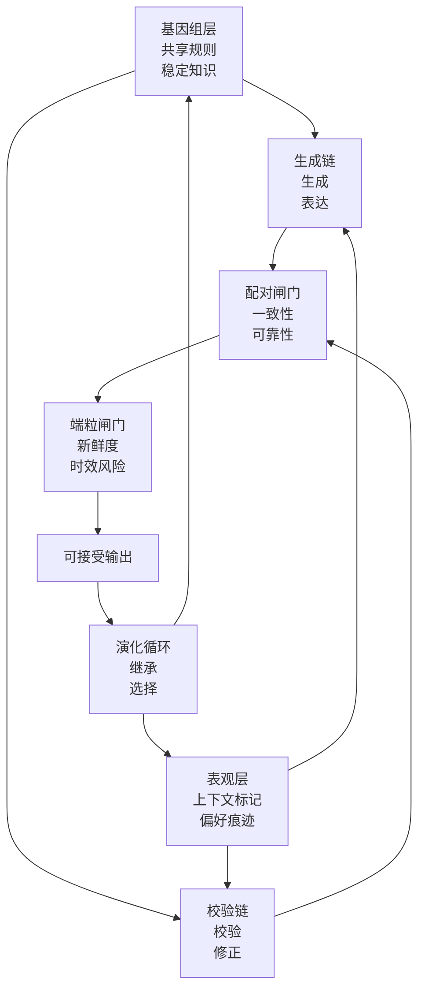
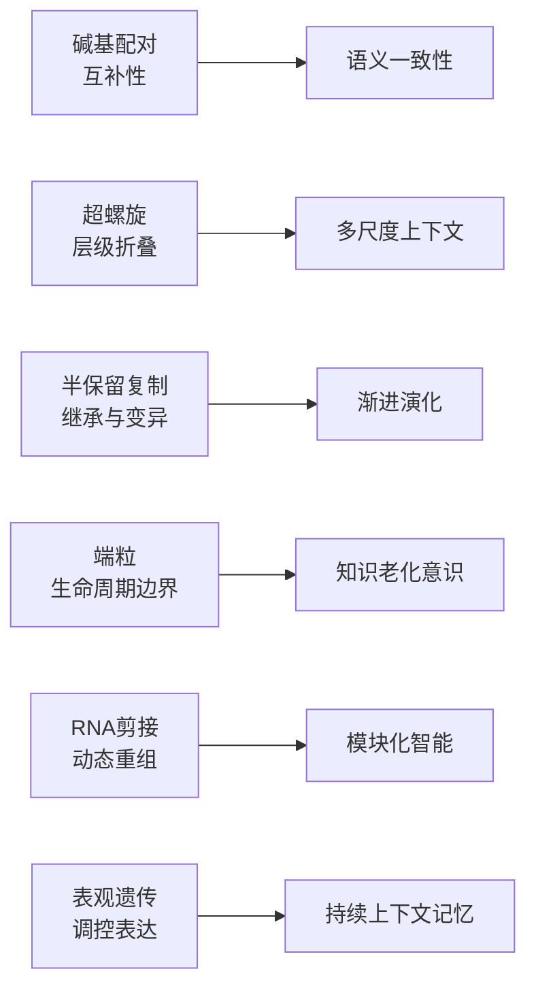
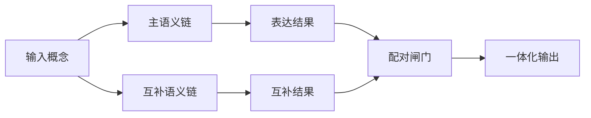
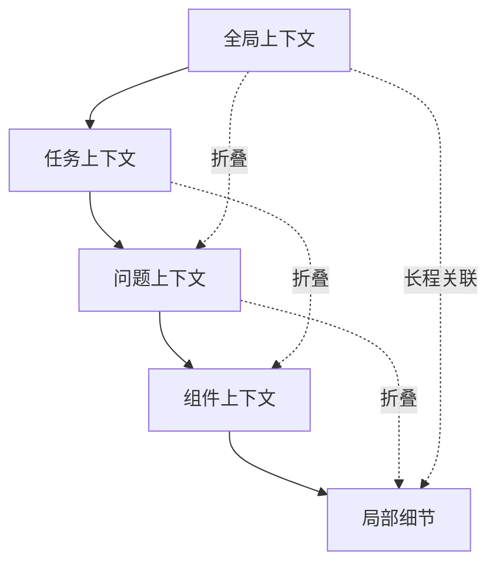
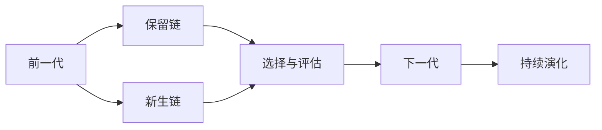
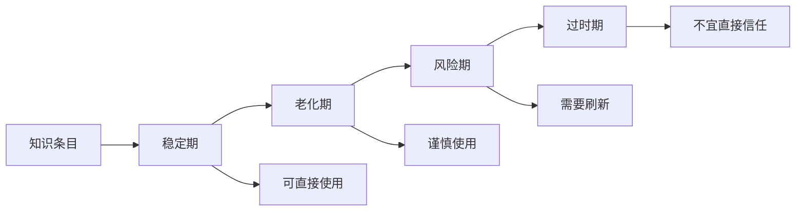
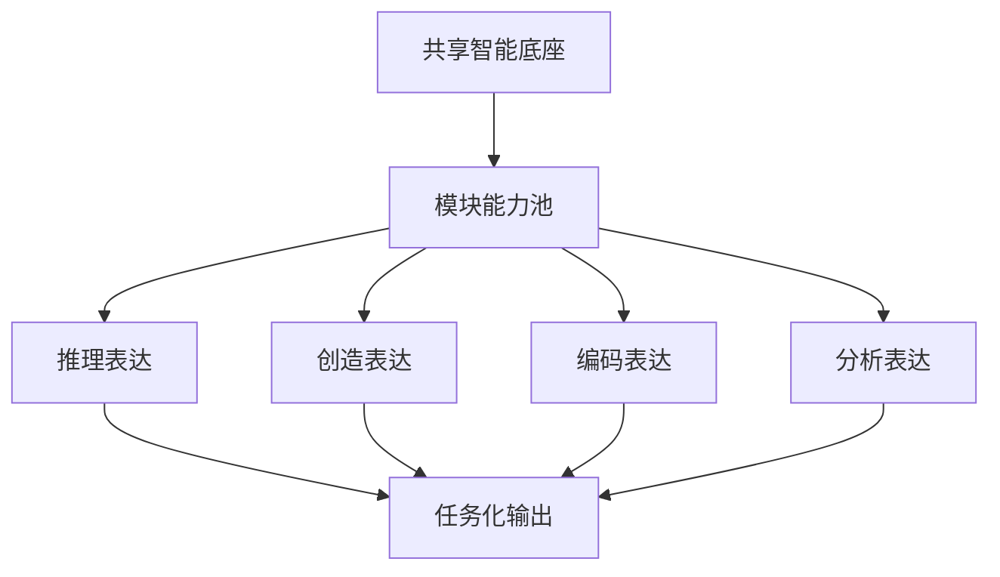
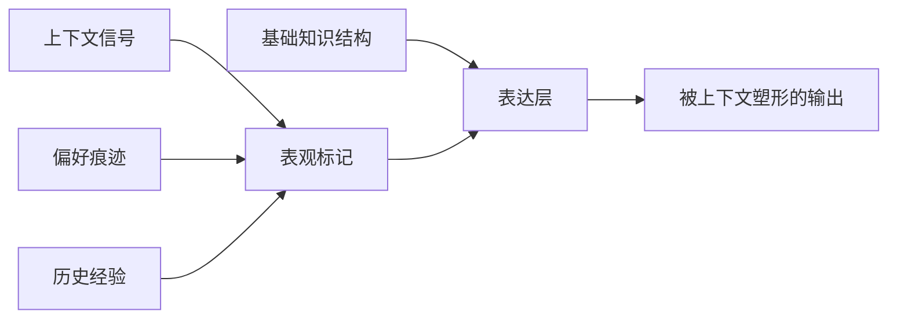

# DNA启发的双螺旋智能框架

> 面向高可靠人工智能与智能体系统的概念框架。

[English](README.md) | [简体中文](README.zh-CN.md)


**项目贡献者**: Shao Shengyi (shaoshengyi)  
**许可协议**: MIT License

## 项目状态

- 概念研究框架
- 聚焦理论表达、问题定义与结构语言
- 不是 benchmark、实现教程或生产工具包

## 项目概述

DNA不仅是一种生物分子，也是一种高度结构化的信息系统。它通过互补配对、层级折叠、模板复制、RNA剪接、表观遗传调控与端粒维护，实现稳定保存、动态组织、继承更新、功能重组与生命周期管理。

本仓库提出一个“DNA启发的双螺旋智能框架”，将这些生物信息机制重新解释为未来人工智能系统中的可靠性、模块性、连续性、时效意识与累积适应能力。

这个框架的核心思想很简单：

- 一条链负责生成与表达
- 一条链负责验证与修正
- 两条链运行在共享规则、持续记忆与演化反馈之上

## 为什么是这个项目

当前AI常常以规模、性能和任务覆盖率来讨论。这个框架认为，未来AI系统还应当从以下维度被重新讨论：

- 一致性
- 自我修正
- 上下文组织
- 模块化表达
- 时间有效性
- 记忆连续性
- 可控演化

DNA启发视角为这些系统属性提供了一种统一语言。

## 内容导航

- 框架总览
- DNA到AI映射
- 六个概念方向
- 仓库内容
- 研究定位
- 这个仓库是什么、不是什么
- 建议引用
- 许可状态
- 致谢
- 建议阅读

## 框架总览

这个框架包含四个概念层：

1. 稳定规则层
2. 上下文标记层
3. 双链执行层
4. 演化反馈层



**图1.** DNA启发的双螺旋智能框架总图。

## DNA到AI映射

下图展示了DNA核心机制如何被重新解释为AI系统原则。



**图2.** DNA核心机制与AI系统概念的抽象映射。

## 六个概念方向

### 1. 互补式语义一致性

可靠智能不应依赖单一路径上的生成结果，而应包含彼此互补的表达视角，以支持一致性、校验与不确定性感知。



**图3.** 碱基配对启发的互补式语义一致性。

### 2. 多尺度上下文组织

智能不仅意味着拥有更多上下文，也意味着能够在全局结构与局部细节之间建立更好的组织关系。



**图4.** 超螺旋启发的多尺度上下文组织。

### 3. 渐进式智能演化

新的智能状态应在保留稳定参照的同时允许受控变化，从而形成累积式进步，而不是完全替代。



**图5.** 半保留复制启发的渐进式智能演化。

### 4. 知识生命周期意识

不是所有知识都应被视为永久有效。成熟系统需要区分稳定知识与时间敏感知识。



**图6.** 端粒启发的知识生命周期意识。

### 5. 动态模块化智能

同一底层智能系统应能够通过动态重组表达不同能力，而不是被看作固定不变的整体。



**图7.** RNA剪接启发的动态模块化智能。

### 6. 持续上下文记忆

智能系统应保留经验痕迹和上下文偏好，而不需要每次都重写整个基础结构。



**图8.** 表观遗传启发的持续上下文记忆。

## 仓库内容

当前仓库包含以下公开文件：

- [README.md](README.md)：英文版 GitHub 首页
- [README.zh-CN.md](README.zh-CN.md)：中文版 GitHub 首页
- [DNA-Double-Helix-Academic.md](DNA-Double-Helix-Academic.md)：双语长篇学术说明
- [CITATION.md](CITATION.md)：双语引用说明
- [LICENSE](LICENSE)：MIT 许可证

当前仓库适合直接用于 GitHub 首页展示、研究介绍页或概念型项目发布。

## 研究定位

这个仓库提供的是一个概念框架，而不是实现路线。它的目标是为可靠性、模块性、长期记忆、时效性与演化连续性提供一种统一的结构语言。

它适合用于：

- 研究议题组织
- 概念论文撰写
- 项目定位表达
- 长篇架构叙事
- AI与智能体系统理论讨论

## 这个仓库是什么、不是什么

### 这是

- 一个概念性研究说明
- 一种面向未来AI系统的结构语言
- 一个统一可靠性、记忆、模块化与演化的理论框架

### 这不是

- benchmark 排行榜
- 实现教程
- 生产级库
- 模型发布仓库

## 建议引用

如果你希望在论文、报告、讲座或项目文档中引用本框架，可以暂时使用下面这条仓库级引用格式：

```bibtex
@misc{dna_double_helix_intelligence_framework_2026,
  author       = {Shao Shengyi},
  title        = {DNA-Inspired Double-Helix Intelligence Framework},
  year         = {2026},
  howpublished = {GitHub repository},
  note         = {Conceptual bilingual framework for reliable AI and agentic systems}
}
```

如果后续你补充了机构名、预印本链接、DOI 或版本号，建议把这条引用更新为最终版本。

更完整的引用说明见 [CITATION.md](CITATION.md)。

## 许可状态

当前仓库已补充正式 [MIT License](LICENSE)。这意味着他人可以在保留原始版权与许可声明的前提下使用、复制、修改、发布与分发本项目内容。

## 致谢

本框架的思想表达受益于分子生物学中关于DNA双螺旋、复制、RNA剪接、表观遗传与端粒机制的经典研究传统，也受益于当代人工智能与智能体系统中关于可靠性、记忆、模块化与长期协同的讨论。

当前 README 的组织方式也参考了成熟高星开源项目在“定位清晰、边界明确、模块可浏览、图示优先”方面的结构表达。

## 建议阅读

1. Watson 与 Crick 关于核酸分子结构的经典论文
2. 关于 DNA 复制与染色体维持的综述文献
3. 关于 RNA 剪接与可变剪接的综述文献
4. 关于表观遗传与基因调控的综述文献
5. 关于端粒生物学与染色体末端保护的综述文献
6. 关于染色质折叠、超螺旋与多尺度基因组组织的综述文献
